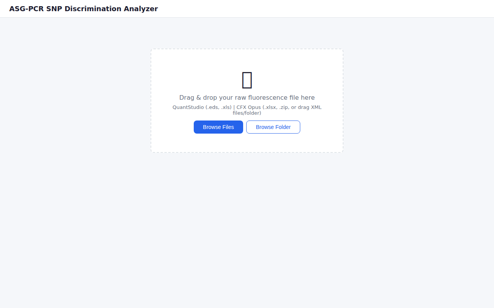
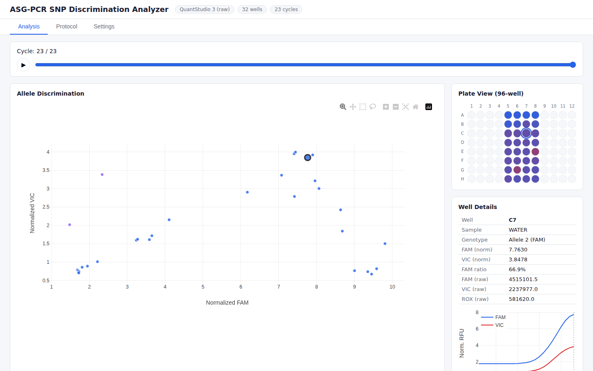

# Q-Prism® SNP Visualizer


A web-based analysis tool for Allele-Specific Genotyping PCR (ASG-PCR) SNP discrimination. Q-Prism® provides interactive visualization of real-time PCR fluorescence data, enabling rapid genotype analysis directly in the browser.

> **Disclaimer**: Q-Prism® is a project name. It is not affiliated with or endorsed by Applied Biosystems, Thermo Fisher Scientific, or Bio-Rad Laboratories.

## Screenshots

| Upload | Analysis |
|:---:|:---:|
|  |  |

## Overview

The SNP Visualizer parses qPCR fluorescence exports and renders interactive scatter plots, plate views, and amplification curves. It supports direct raw-file imports for existing QuantStudio and Bio-Rad workflows, plus a preview-and-mapping workflow for generic per-cycle fluorescence tables, Q-Prism RDES templates, and RDML files.

## Features

- **Allelic Discrimination Scatter Plot** -- WT vs. MT1 labels with dye metadata, WebGL-accelerated
- **96-Well Plate View** -- Color-coded wells with bidirectional selection (click plate or scatter point to sync)
- **Cycle-by-Cycle Slider** -- Animate amplification progress with play/pause controls
- **Per-Well Amplification Curves** -- Click any well to view its full fluorescence trajectory
- **Smart File Detection** -- Auto-identifies direct vendor formats and routes ambiguous tables to preview/mapping
- **Template-Based Imports** -- Downloadable Q-Prism RDES, generic long CSV, and generic wide CSV templates
- **Role-Aware Mapping** -- Keeps dye/channel names separate from WT/MT roles and selected normalization channel
- **PCR Protocol Editor** -- Interactive thermal profile visualization
- **Multi-File Drag-and-Drop** -- Drop multiple XML files or entire folders; client-side ZIP packaging via JSZip

## Supported Instruments and Formats

| Instrument | Format | Description |
| :--- | :--- | :--- |
| **QuantStudio 3** (Applied Biosystems) | `.eds` | Raw instrument files (ZIP archive with multicomponent XML) |
| | `.xls` | Exported Multicomponent Data or Amplification Data |
| **CFX Opus** (Bio-Rad) | `.pcrd` | Raw encrypted CFX Opus run files |
| | `.xlsx` | Amplification Results, End Point Results, or Allelic Discrimination |
| | `.zip` | Archived XML exports (~16 files per run) |
| | Folder / multi-XML | Drag-and-drop XML files or folders (auto-zipped client-side) |
| **Q-Prism Template Imports** | `.tsv`, `.csv` | RDES extension, generic long, and generic wide template downloads |
| **Generic qPCR Tables** | `.csv`, `.tsv`, `.txt`, `.xlsx` | Preview-first mapping of well, cycle, channel/dye, RFU, sample, and target columns |
| **RDML / Rotor-Gene** | `.rdml`, `.rdm` | Preview-first RDML parser with run, target, channel, and role confirmation |
| **Vendor Presets** | text/CSV/XLSX/RDML | Roche LightCycler text, Analytik Jena qPCRsoft, and Qiagen Rotor-Gene presets prefill mappings only |

Direct upload creates sessions for supported QuantStudio/Bio-Rad files. Generic, RDES, and RDML files use `/api/import/preview` and `/api/import/parse` so users can confirm table structure, assay mode, and channel-to-role mappings before import.

Triplex and quadruplex imports (`WT/MT1/MT2`, `WT/MT1/MT2/MT3`) remain preview-only until full role-aware downstream analysis is enabled. WT/MT duplex imports can create analysis sessions.

### Template Downloads

The upload screen offers these templates from `/templates/`:

- `qprism-rdes-amplification-template.tsv`
- `qprism-generic-long-template.csv`
- `qprism-generic-wide-template.csv`

Strict RDES files without Q-Prism role/channel columns are preview-only. The Q-Prism RDES extension includes explicit per-channel role data so WT/MT duplex files can be validated and imported.

## Quick Start

### Prerequisites

- Docker

### Run

```bash
git clone https://github.com/Key-man-fromArchive/Q-Prism-SNP-visualizer.git
cd Q-Prism-SNP-visualizer/snp-analyzer
docker compose up --build
```

Open `http://localhost:8002` in your browser.

### Local Development (without Docker)

```bash
cd snp-analyzer
python -m venv venv
source venv/bin/activate
pip install -r requirements.txt
uvicorn app.main:app --reload --port 8002
```

## Testing

Backend parser/API regression tests:

```bash
cd Q-Prism-SNP-visualizer
pytest -q snp-analyzer/tests
```

Frontend build:

```bash
cd Q-Prism-SNP-visualizer/snp-analyzer/frontend
npm install
npm run build
```

For subpath deployments, build the frontend with `VITE_APP_BASE_PATH=/your-path/` and set the matching backend `SNP_ROOT_PATH`.

Legacy Playwright tests are still present, but several specs target the pre-React static UI and external local fixture paths. Update those specs before treating them as a release gate for the current React upload/mapping workflow.

```bash
# From project root
npm install
npx playwright install chromium
npx playwright test
```

## Architecture

### Backend (Python / FastAPI)

- **Smart Detector** (`detector.py`) -- routes direct vendor files to legacy parsers
- **Import Preview API** -- `/api/import/preview` and `/api/import/parse` handle mapping-configured imports
- **Parsers** -- QuantStudio, CFX Opus, CFX XML ZIP, Q-Prism RDES, generic tables, and RDML
- **Normalization** -- uses selected mapping normalization channel/mode when present, with legacy ROX fallback
- **Session Store** -- In-memory with Pydantic `UnifiedData` model
- **Endpoints** -- `POST /api/upload`, `POST /api/import/preview`, `POST /api/import/parse`, `GET /api/data/{session_id}/scatter`, `/plate`, `/amplification`

### Frontend (React / Vite)

- **Plotly.js** -- WebGL `scattergl` for performant rendering
- **JSZip** -- Client-side ZIP creation for multi-file uploads
- **Mapping Wizard** -- Preview, column mapping, assay role binding, validation messages, and import action
- **Role Labels** -- Displays WT/MT1 labels while preserving dye/channel metadata in tooltips and responses

## Project Structure

```
snp-analyzer/
  app/
    main.py                 # FastAPI entry point
    config.py               # Constants (session expiry, upload limits)
    models.py               # Pydantic data models
    parsers/
      detector.py           # Smart file format detection
      quantstudio.py        # QuantStudio 3 .xls parser
      cfx_opus.py           # CFX Opus .xlsx parser
      cfx_xml_parser.py     # CFX XML ZIP parser
      eds_raw.py            # QuantStudio .eds raw parser
      generic_table.py      # Generic CSV/TSV/TXT/XLSX mapping parser
      rdes.py               # Q-Prism RDES template parser
      rdml.py               # RDML preview/import parser
      vendor_presets.py     # Mapping prefill presets
      xlsx_fixer.py         # CFX xlsx repair utility
    processing/
      normalize.py          # Role-aware normalization context
    routers/
      upload.py             # File upload endpoint
      import_api.py         # Preview and mapped import endpoints
      data.py               # Data retrieval endpoints
    static/
      templates/            # Downloadable import templates
    frontend/
      src/                   # React application
      public/templates/      # Template assets copied into static-react
  Dockerfile
  docker-compose.yml
  requirements.txt
tests/                      # Playwright E2E tests
playwright.config.ts
docs/                       # Planning, screenshots, and import fixture notes
```

## License

MIT
