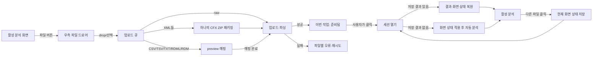
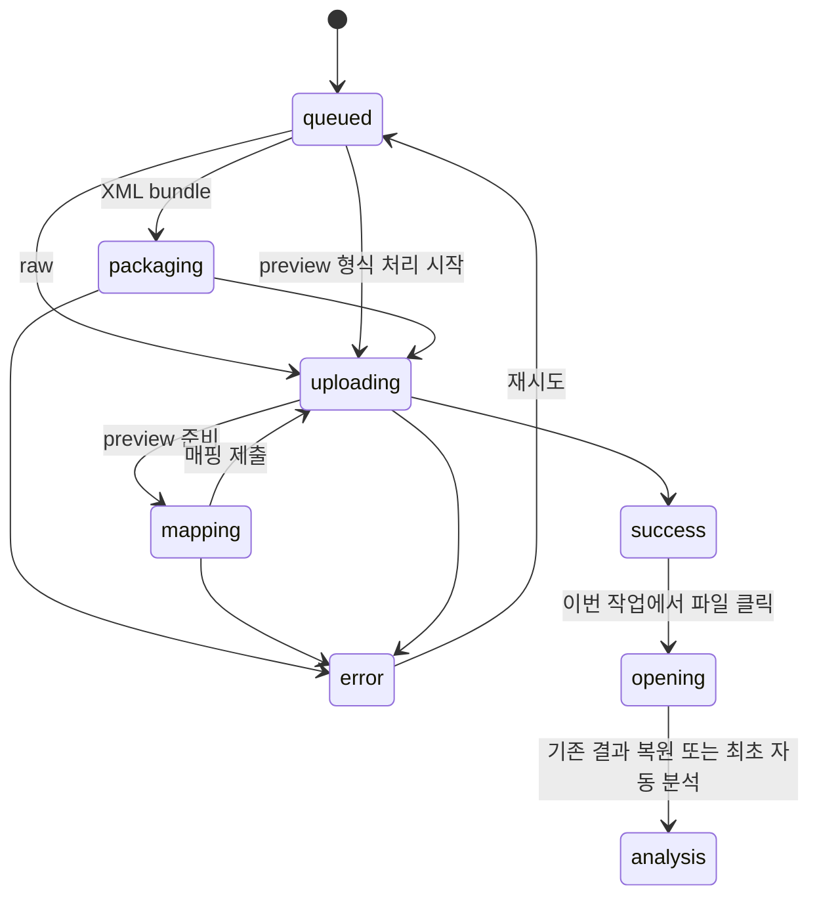
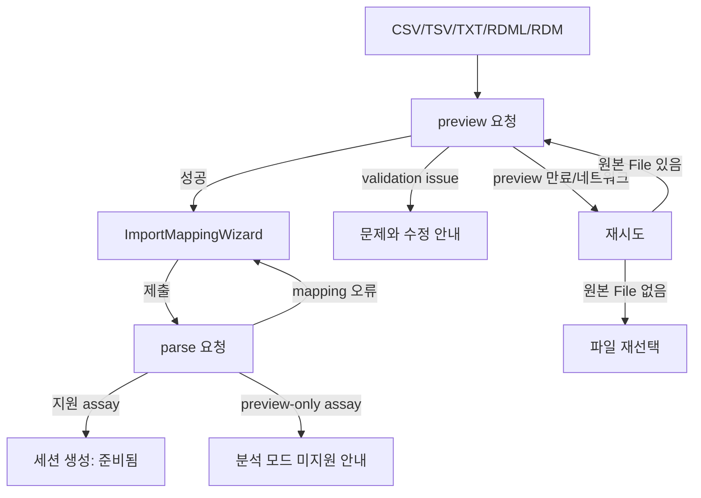
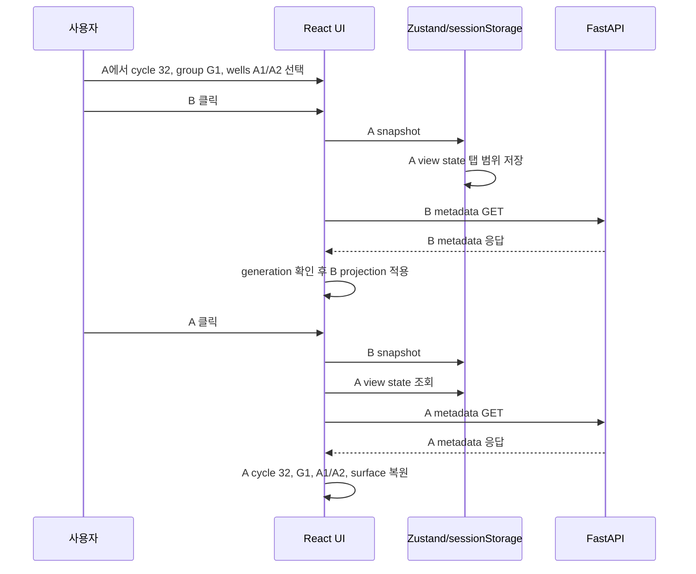
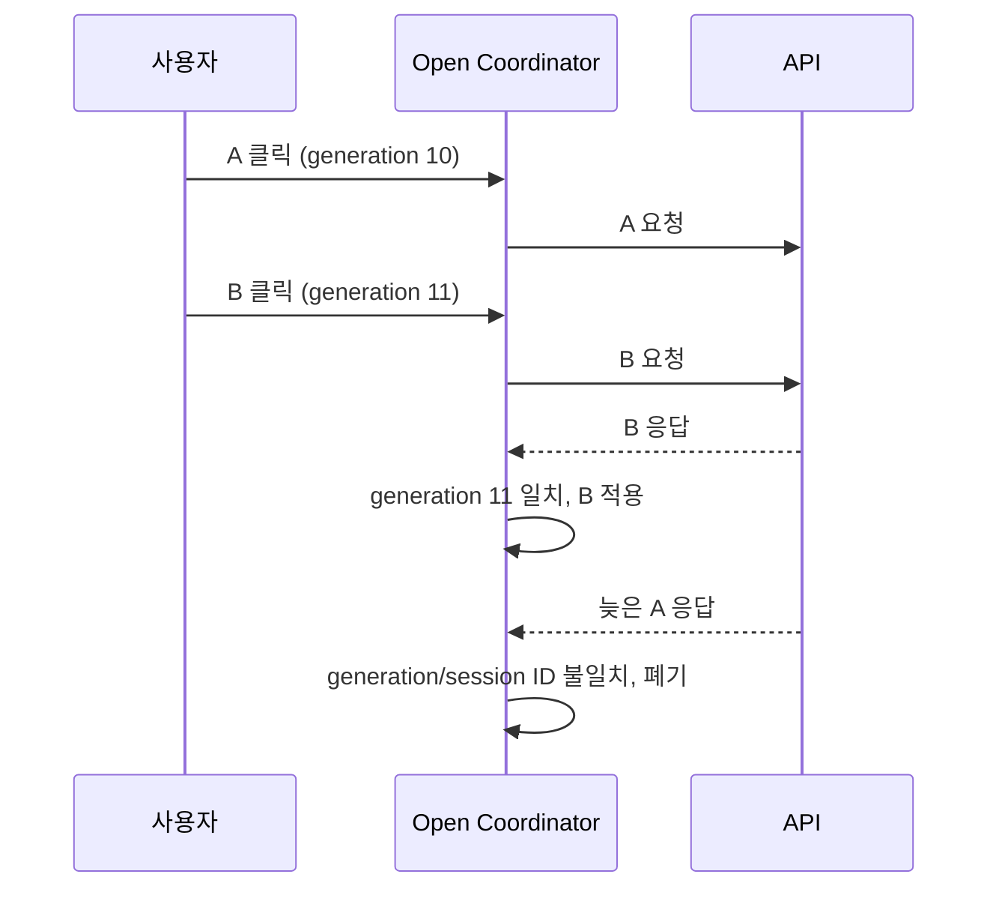

# Q-Prism 다중 파일 작업공간 사용자 플로우

## 1. 메인 플로우

업로드·파싱 중 A의 활성 session은 변경되지 않는다. 전환은 G나 최근 파일을 사용자가 직접 클릭했을 때만 일어난다.

## 2. 드로어 진입과 종료

### 진입

1. 사용자가 헤더의 `파일 N` 버튼을 누른다.
2. 우측에서 drawer가 열리고 포커스가 drawer 제목 또는 첫 유효 control로 이동한다.
3. `이번 작업`, 업로드 큐, `최근 파일`을 한 화면에서 본다.

### 종료

- X, 바깥 영역, Escape로 닫을 수 있다.
- 닫은 뒤 포커스는 헤더의 파일 버튼으로 돌아간다.
- drawer를 닫아도 upload는 계속된다.
- drawer 종료는 session 닫기나 삭제가 아니다.

## 3. 다중 업로드 플로우

### 형식 그룹화

1. 선택 파일을 extension 기준으로 정규화한다.
2. 지원하지 않는 파일은 제외하고, 지원 파일이 하나도 없으면 drawer 오류를 표시한다.
3. raw 파일은 한 파일당 한 항목으로 만든다.
4. 동일 선택에 포함된 모든 XML은 `CFX XML 묶음 · N개` 한 항목으로 만든다.
5. CSV/TSV/TXT/RDML/RDM은 한 파일당 preview/mapping 항목으로 만든다.
6. count/총 크기 제한을 넘으면 네트워크 요청 전에 선택 전체를 거절하고 현재 큐는 유지한다.

### 부분 실패

성공 항목은 `업로드 완료`로 남고 실패 항목에는 원인과 `재시도`가 표시된다. 전체 재업로드를 요구하지 않는다. 재시도는 해당 항목의 이전 오류를 지우고 그 항목만 다시 처리한다.

## 4. 매핑 대기 플로우

여러 preview/mapping 항목이 있어도 wizard는 queue에서 처음 발견한 한 항목에만 열린다. wizard를 닫은 항목은 오류 상태가 되며 재시도로 preview/mapping을 다시 시작할 수 있다.

## 5. 파일 열기와 복원

### 기존 결과가 있는 파일

1. 현재 A의 view state를 Zustand store에 snapshot하고 `sessionStorage` persistence에 반영한다.
2. 기존 detail API로 B의 session info를 요청한다.
3. 응답이 최신 open generation인지 확인한다.
4. B의 저장 state가 있으면 selection/settings/surface를 적용하고, 없으면 기본 상태를 사용한다.
5. stale data를 비운 뒤 B의 session/data/view projection을 적용한다.
6. 저장된 cluster를 표시하고 자동 분석을 실행하지 않는다.
7. drawer의 B를 활성 상태로 표시한다.

### 기존 결과가 없는 파일

1~5는 동일하다.

6. 복원 완료 후 추천 cycle을 구하고 자동 clustering을 한 번 실행한다.
7. 분석 중에도 drawer를 열거나 다른 파일로 갈 수 있다.
8. B가 활성 상태일 때 완료되면 B 화면에 적용한다. 이미 C로 이동했다면 B 캐시/서버 결과만 갱신하고 C 화면은 변경하지 않는다.

### 열기 실패

- 기존 활성 A를 유지한다.
- drawer의 공통 오류 영역에 원인을 표시한다.
- 404는 session 만료/삭제, 403은 접근 권한 없음, network는 연결 문제로 구분한다.

## 6. A→B→A 복원 시나리오

CycleControl은 저장된 window/cycle을 먼저 읽고 유효하지 않거나 값이 없을 때만 추천 cycle/기본값을 사용한다. 자동 분석 effect는 기존 cluster를 먼저 확인한다.

## 7. 빠른 전환 예외 플로우

늦은 A 응답은 active session/data/selection/settings를 변경해서는 안 된다. 분석 결과가 서버에 정상 저장됐다면 다음 A 열기에서 사용할 수 있다.

## 8. 이번 작업과 최근 파일

### 최근 파일 열기

1. 사용자가 `최근 파일`의 세션을 클릭한다.
2. 항목을 `이번 작업` 배열 끝에 중복 없이 추가한다.
3. 일반 파일 열기 플로우를 수행한다.
4. 서버 목록 순서는 기존 `uploaded_at` 최신순을 유지한다.

### 작업 목록에서 닫기

1. 항목의 overflow/닫기 control을 누른다.
2. 비활성 항목이면 즉시 이번 작업에서 제거한다.
3. 활성 항목이면 남은 작업 목록의 첫 번째 항목을 연다. 남은 항목이 없으면 session projection을 안전하게 비우고 drawer의 drop zone/최근 파일을 유지한다.
4. 서버 session과 분석 결과는 삭제하지 않는다. 닫은 항목은 최근 파일에 다시 나타날 수 있다.

### 영구 삭제

drawer의 `프로젝트에서 관리`를 눌러 프로젝트 화면으로 이동한다. 기존 확인 dialog를 거친 삭제 플로우만 서버 데이터를 삭제한다.

## 9. 화면별 진입/행동/이탈

| 화면/표면 | 진입 | 주요 행동 | 이탈 |
| --- | --- | --- | --- |
| 분석 작업공간 | 로그인 후 session 열기 | 분석, selection/filter/cycle 변경, 파일 버튼 | 다른 top-level tab 또는 session 전환 |
| 파일 drawer | 헤더 파일 버튼 | 업로드, 목록 확인, 열기, 닫기, retry, mapping | Escape/X/바깥 클릭 또는 프로젝트 이동 |
| 매핑 wizard | preview/mapping 항목 | preview 확인, channel role mapping 제출 | 완료→업로드 완료, 닫기→오류/재시도 |
| 프로젝트 화면 | top nav 또는 drawer 링크 | 장기 보관, 그룹 관리, 영구 삭제 | session 불러오기 또는 다른 tab |

## 10. 오류/빈/로딩 상태

- 이번 작업 없음: drop 안내와 최근 파일을 표시한다.
- 최근 파일 없음: 최근 section을 생략하되 업로드는 가능하다.
- recent 조회 실패: upload/이번 작업은 유지하고 `최근 파일을 불러오지 못함`과 retry만 표시한다.
- session 만료/삭제: 목록 refresh에서 사용할 수 없는 ID를 이번 작업에서 정리하고, 직접 열기 실패는 drawer 오류로 표시한다.
- 인증 만료: 기존 전역 인증 처리로 이동하며 raw File 내용은 browser storage에 남기지 않는다.
