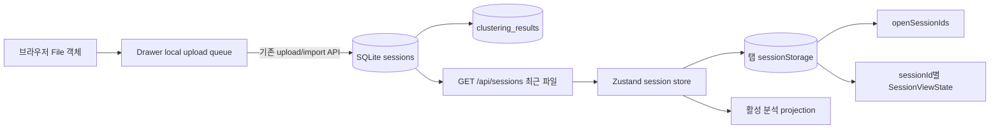

# Q-Prism 다중 파일 작업공간 데이터 경계 설계

## 1. 결론

이 MVP는 SQLite schema를 변경하지 않는다. 기존 `sessions`와 `clustering_results`가 업로드 세션과 분석 결과를 영속화하며, 이번 작업 목록과 파일별 view state는 현재 브라우저 탭의 `sessionStorage`에만 저장한다.

신규 `session_view_states`/workspace table, `last_opened_at` column, view-state/opened API는 만들지 않는다. 최근 파일은 기존 `sessions.created_at`이 API의 `uploaded_at`으로 반환되는 순서를 사용한다.

## 2. 전체 데이터 경계



| 데이터 | 소유자 | 영속 범위 | 서버 저장 여부 |
| --- | --- | --- | --- |
| raw `File`, XML source/ZIP Blob | drawer queue | 현재 page memory | 아니오 |
| queue 단계/오류/preview | drawer queue | 현재 page memory | preview 임시 저장 외 장기 저장 없음 |
| 열린 session ID 배열 | Zustand persist | 현재 브라우저 탭 `sessionStorage` | 아니오 |
| 파일별 selection/settings/surface | Zustand persist | 현재 브라우저 탭 `sessionStorage` | 아니오 |
| session metadata/cycle data | FastAPI/SQLite | 기존 30일 retention | 예 |
| cluster/분석 결과 | FastAPI/SQLite | session 생명주기 | 예 |
| 최근 파일 순서 | `sessions.created_at` | session 생명주기 | 예, 기존 column |

## 3. 기존 ERD

```mermaid
erDiagram
    USERS ||--o{ SESSIONS : owns
    SESSIONS ||--o| CLUSTERING_RESULTS : has
    SESSIONS ||--o{ WELL_CYCLE_DATA : contains
    SESSIONS ||--o{ MANUAL_WELLTYPES : overrides
    SESSIONS ||--o{ SAMPLE_NAME_OVERRIDES : names
    SESSIONS ||--o{ WELL_GROUPS : groups
    PROJECTS ||--o{ PROJECT_SESSIONS : contains
    SESSIONS ||--o{ PROJECT_SESSIONS : belongs_to

    SESSIONS {
      text session_id PK
      text user_id FK
      text raw_filename
      text instrument
      integer num_wells
      integer num_cycles
      text created_at
    }

    CLUSTERING_RESULTS {
      text session_id PK_FK
      text result_json
      integer cycle
      text created_at
    }
```

이 기능은 위 관계나 delete cascade를 바꾸지 않는다.

## 4. 기존 SQLite 필드 사용

### `sessions`

| 기존 컬럼 | 기능에서의 용도 |
| --- | --- |
| `session_id` | 이번 작업/최근 목록/활성 session 연결 key |
| `user_id` | 기존 session 접근 권한 범위 |
| `raw_filename` | drawer의 파일 표시명; upload/detail response에 추가 |
| `instrument` | 파일 행 보조 정보 |
| `num_wells`, `num_cycles` | 파일 행 요약과 view state 유효성 판단 |
| `created_at` | `uploaded_at`으로 반환하고 최근 목록 내림차순 정렬 |
| `metadata_json` | 기존 data windows/groups/normalization metadata 복원 |

### `clustering_results`

기존 결과 유무와 전체 `result_json` 복원에 사용한다. 결과가 있으면 재분석하지 않고, 없으면 최초 열기 자동 분석을 실행한다. view state를 이 table에 섞지 않는다.

## 5. `sessionStorage` 논리 schema

Zustand persist key는 `qprism-file-workspace`다. 저장 payload는 구현 store의 일부만 포함한다.

```json
{
  "state": {
    "openSessionIds": ["sid-a", "sid-b"],
    "viewStates": {
      "sid-a": {
        "activeSurface": "analysis",
        "selection": {
          "selectedWell": null,
          "selectedWells": ["A1", "A2"],
          "selectedGroup": "Marker 1",
          "focusSelectedWells": true,
          "currentCycle": 32,
          "currentDataWindow": "Amplification"
        },
        "settings": {
          "useRox": true,
          "backgroundMode": "none",
          "axisMode": "manual",
          "scatterTool": "select",
          "lockAspect": true,
          "fixAxis": true,
          "xMin": 0,
          "xMax": 12,
          "yMin": 0,
          "yMax": 12,
          "clusterAlgorithm": "threshold",
          "ntcThreshold": 0.1,
          "allele1RatioMax": 0.4,
          "allele2RatioMin": 0.6,
          "nClusters": 4,
          "ploidy": 2,
          "showBoundaryLines": false,
          "showAutoCluster": true,
          "showManualTypes": true,
          "showEmptyWells": false
        }
      }
    }
  },
  "version": 1
}
```

### 저장하지 않는 값

- active `sessionInfo`, well groups와 plot/plate data
- queue, `File`, Blob, XML source와 import preview
- 스크롤 위치와 재생 상태
- 열린 modal/menu/context popup, hover/drag/focus
- auth token, raw/sample data, sample identifier

## 6. 저장·복원 규칙

### 저장

1. session A에서 B로 바꾸기 직전에 A의 selection/settings/current surface를 캡처한다.
2. `viewStates[A]`를 교체하고 Zustand persist가 같은 탭의 `sessionStorage`에 기록한다.
3. 업로드 성공 또는 recent session 열기 시 ID를 `openSessionIds` 끝에 중복 없이 추가한다.
4. 작업 목록 닫기는 해당 ID만 배열에서 제거하며 SQLite를 변경하지 않는다.

### 복원

1. `GET /api/sessions/{sid}` 성공 뒤 target `viewStates[sid]`를 조회한다.
2. 값이 있으면 selection/settings/surface를 활성 projection에 적용하고 `isPlaying=false`로 강제한다.
3. 값이 없으면 selection 기본값과 session의 ROX/background 제약을 적용한다.
4. stale plot/plate data는 session 전환 즉시 비운다.
5. session 목록 새로고침에서 서버에 없는 ID는 `openSessionIds`에서 제거한다.

scroll, modal, 재생은 복원하지 않는다. 새 탭이나 탭 종료 후에는 view state가 없으므로 서버 session은 최근 파일에서 열되 화면은 기본값으로 시작한다.

## 7. 최근 session 쿼리

기존 `GET /api/sessions` 구현은 DB에서 다음 필드를 조회하고 생성 시각 내림차순을 사용한다.

```sql
SELECT session_id, raw_filename, created_at
FROM sessions
WHERE user_id = ?
ORDER BY created_at DESC;
```

관리자의 기존 전체 조회와 ASG launch mode 정책도 같은 원칙을 유지한다. API는 `created_at`을 `uploaded_at`으로 반환한다. 별도의 마지막 열기 시각을 만들지 않는다.

## 8. 생명주기

- upload 성공: 기존 `sessions`/cycle data 생성, session ID를 브라우저 작업 목록에 추가
- 최초 open: 브라우저 view state 적용, cluster가 없으면 기존 분석 경로 실행
- 재열기: 같은 탭에 view state가 있으면 복원, cluster가 있으면 결과 복원
- 작업 목록 닫기: `openSessionIds`에서만 제거, DB 변경 없음
- 탭 종료: open IDs/view states 소멸, SQLite session/결과 유지
- 프로젝트 영구 삭제 또는 retention: 기존 session 삭제와 cascade 유지

## 9. 무결성·보안 수용 기준

- 신규 DB migration/table/column이 없다.
- `raw_filename`은 upload response와 session detail/list에서 기존 DB 값과 일치한다.
- recent 목록은 `uploaded_at` 내림차순이다.
- 작업 목록 닫기 전후 DB session 수가 같다.
- 다른 사용자 session detail/분석 접근은 기존 정책대로 403/404다.
- `sessionStorage` payload에 File 본문, preview, token, sample identifier가 없다.
- 탭을 새로 열면 다른 탭의 open IDs/view states를 읽지 않는다.
- session 삭제 후 목록 refresh가 사라진 ID를 open list에서 제거한다.

## 10. 위험과 비목표

위험은 브라우저 저장 payload가 손상되거나 이전 코드 형태일 수 있다는 점이다. store hydration과 복원 시 필드 존재/enum/range를 방어적으로 다루고, 사용할 수 없는 상태는 해당 session의 기본값으로 대체한다.

비목표:

- SQLite `session_view_states` 또는 workspace table
- `sessions.last_opened_at`이나 최근 열기 추적
- 신규 view-state/opened endpoint
- 새 탭·브라우저·기기 간 view state 동기화
- 업로드 queue/원본 파일의 영속화와 재개
