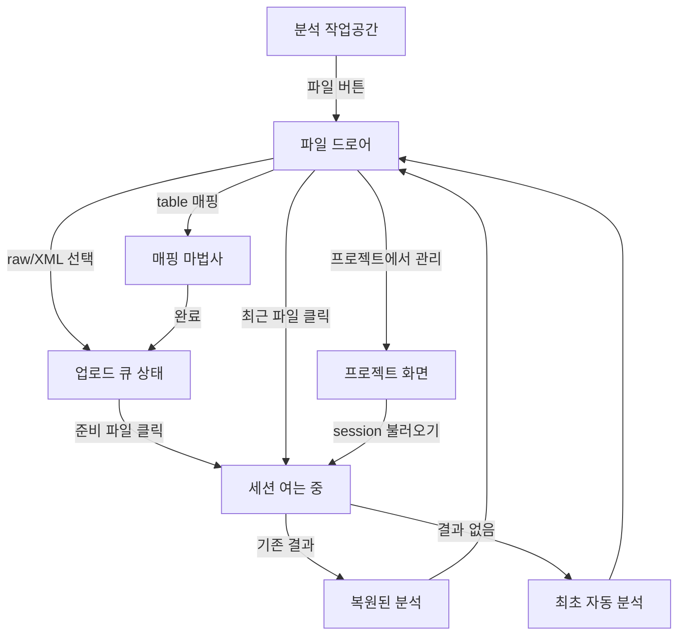

# Q-Prism 다중 파일 작업공간 화면 목록

이 문서는 후속 `/screen-spec`의 입력이다. 새 route를 늘리기보다 기존 분석 화면에 drawer와 mapping modal을 결합한다.

## 화면 1: 분석 작업공간 + 파일 트리거

- ID: `screen-file-workspace-host`
- 경로: `/` (기존 SPA 경로 및 root path 보존)
- 진입: session을 연 상태, 또는 최근/session open 성공 후
- 목적: 현재 분석을 유지하면서 파일 drawer 진입점을 항상 제공
- 주요 기능:
  - 현재 파일명/세션 요약 표시
  - `파일 N` 버튼으로 drawer 열기
  - session별 cycle/filter/selection/surface 변경 감지
  - 전환 직전 view snapshot
- 컴포넌트:
  - 기존 `Header`, `TabNavigation`, `AnalysisWorkspace`
  - `FileTriggerButton`
  - 전역 `FileDrawer` mount point
- 상태:
  - 활성 session 있음/없음
  - background upload 없음/진행/일부 실패
  - session opening/analysis 진행
- 수용 기준:
  - background upload 중 기존 분석이 unmount/reset되지 않는다.
  - 파일 버튼은 session이 없어도 인증된 기본 화면과 프로젝트 tab에서 접근 가능하다.

## 화면 2: 파일 작업공간 드로어

- ID: `screen-file-drawer`
- 경로: route 없음, `screen-file-workspace-host` 위 dialog/drawer
- 진입: 헤더 `파일 N` 클릭
- 목적: 업로드, 이번 작업 전환, 최근 session 열기를 한 곳에서 수행
- 주요 기능:
  - drag/drop, 파일 선택, 폴더 선택
  - 파일별 업로드 단계/오류/재시도
  - `이번 작업` session 열기/닫기
  - `최근 파일` session 열기
  - 프로젝트 관리 화면 이동
- 컴포넌트:
  - `DrawerHeader`, `CompactDropZone`
  - `UploadQueueList`/`FileQueueItem`
  - `WorkspaceFileList`/`WorkspaceFileItem`
  - `RecentSessionList`/`RecentSessionItem`
  - `StatusState`, `Button`, `IconButton`, `Callout`
- 상태:
  - 전체 empty
  - recent loading/error/empty
  - queue processing/partial success/error
  - active/inactive/unavailable session
  - drag active, count/size rejected
- 수용 기준:
  - drawer 열기 첫 시각 피드백 100ms 이내다.
  - Escape/focus trap/focus restore와 200% zoom에서 사용할 수 있다.
  - 드로어에 영구 삭제 action이 없다.

## 화면 3: 매핑 마법사

- ID: `screen-import-mapping`
- 경로: route 없음, 파일 drawer에서 여는 modal
- 진입: CSV/TSV/TXT/RDML/RDM 항목의 preview 완료
- 목적: preview와 channel-role mapping을 완료해 분석 session 생성
- 주요 기능:
  - 기존 preview 정보와 validation issue 표시
  - assay/channel mapping 설정
  - parse 제출, 오류 수정, 닫기 후 재시도
  - preview 만료 시 재시도 또는 파일 재선택
- 컴포넌트:
  - 기존 `ImportMappingWizard`
  - `MappingQueueContext`, `ValidationIssueList`, `StatusState`
- 상태:
  - CSV/TSV/TXT/RDML/RDM previewing, mapping, validation failed, parsing, preview expired, unsupported analysis mode
- 수용 기준:
  - 동시에 하나의 wizard만 열린다.
  - 닫은 항목은 오류/재시도 상태로 남는다.
  - 완료 전 활성 분석 session은 변경되지 않는다.

## 화면 4: 세션 여는 중/복원 상태

- ID: `screen-session-opening`
- 경로: `/` 내부 상태
- 진입: 이번 작업 또는 최근 파일 클릭
- 목적: 이전 session 데이터가 새 파일명 아래 보이는 것을 막고 전환 상태를 설명
- 주요 기능:
  - 기존 detail API로 metadata 요청
  - `sessionStorage`의 view state와 서버의 기존 분석 결과 연결
  - 실패 시 기존 활성 분석 유지
  - 성공 시 target projection 원자 적용
- 컴포넌트:
  - drawer의 session row와 오류 안내
  - 기존 분석 workspace
- 상태:
  - metadata loading, restore, existing-result load, first-analysis start, error
- 수용 기준:
  - rapid switch 역순 응답이 active store를 덮지 않는다.
  - target open 실패 시 이전 session ID와 화면이 유지된다.

## 화면 5: 최초 열기 자동 분석

- ID: `screen-first-open-analysis`
- 경로: `/`의 기존 분석 workspace
- 진입: 결과가 없는 준비 session open 성공
- 목적: view state 적용 후 별도 확인 없이 한 번 분석
- 주요 기능:
  - 추천 cycle 조회
  - single/multi-marker 기존 분석 경로 실행
  - 진행/오류/재시도
  - 다른 session 전환 허용
- 컴포넌트:
  - 기존 `AnalysisWorkspace`, `AnalysisTab` 또는 `MultiMarkerAnalysisPanel`
  - 기존 analyze status와 `StatusState`
- 수용 기준:
  - 결과 없는 첫 열기당 자동 실행 1회다.
  - 저장 결과가 있는 재열기에서는 자동 실행 0회다.
  - 백그라운드 완료가 다른 활성 session 화면을 바꾸지 않는다.

## 화면 6: 복원된 분석 작업공간

- ID: `screen-restored-analysis`
- 경로: `/`의 기존 분석 workspace
- 진입: 기존 결과/view state가 있는 session open
- 목적: 이전 작업 맥락으로 즉시 복귀
- 주요 기능:
  - cycle/window/selection/group/filter 복원
  - plate/analysis surface와 axis/tool 복원
  - 저장 결과 표시
- 컴포넌트:
  - 기존 `CycleControl`, `ScatterPlot`, `PlateView`, `ResultsTable`
  - 세션별 상태가 연결된 `AnalysisWorkspace`
- 수용 기준:
  - A→B→A에서 지정 view state가 일치한다.
  - scroll/play/modal/context menu는 복원하지 않는다.

## 화면 7: 프로젝트 관리 화면

- ID: `screen-project-management-existing`
- 경로: `/` 내부 기존 `project` tab
- 진입: top navigation 또는 drawer의 `프로젝트에서 관리`
- 목적: 장기 보관, 그룹 관리, 영구 삭제라는 기존 역할 유지
- 주요 기능:
  - 기존 project/session 관리
  - 기존 확인 절차 후 영구 삭제
  - session 불러오기 시 공통 session opener 사용
- 컴포넌트:
  - 기존 `BatchTab`
  - 공통 session open coordinator 연결
- 수용 기준:
  - drawer의 닫기가 이 화면의 session을 삭제하지 않는다.
  - 영구 삭제 후 작업/최근 목록에서 해당 session이 제거된다.

## 화면 간 이동

## 공통 컴포넌트 목록

- `FileWorkspaceDrawer`
- `SessionRow`
- 기존 `ImportMappingWizard`
- 기존 `Button`, `IconButton`, `StatusState`, `Callout`, `Modal`

## 화면별 공통 제약

- root path 배포를 깨는 새 absolute route를 만들지 않는다.
- 모든 session open 진입점은 같은 coordinator를 사용한다.
- KO/EN과 light/dark를 지원한다.
- 모바일에서 drop이 불가능해도 file/folder picker로 모든 핵심 과업을 수행한다.
- 파일명과 오류가 길어도 action과 focus ring이 가려지지 않는다.

## 명시적 비화면

- batch analysis dashboard는 만들지 않는다.
- drawer 내부 project editor/delete confirmation은 만들지 않는다.
- upload 성공 toast를 session 전환 수단으로 사용하지 않는다.
